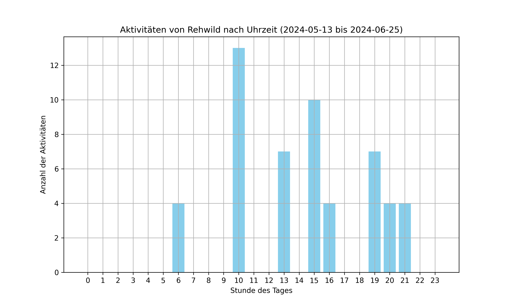
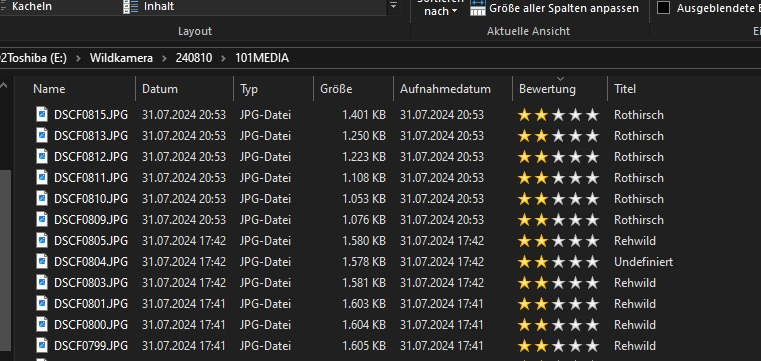

# WildlifeCam

`wildlifecam.py` is a Python script designed to analyze and modify metadata from images captured with wildlife cameras. It reads data from a CSV file, updates image metadata, and creates visual evaluations of activity patterns of different animal species.

`wildlifecam.py` ist ein Python-Skript, das darauf ausgelegt ist, Metadaten von Bildern zu analysieren und zu bearbeiten, die mit Wildkameras aufgenommen wurden. Das Skript liest Daten aus einer CSV-Datei, passt Metadaten von Bildern an, und erstellt visuelle Auswertungen der Aktivitäten verschiedener Tierarten.

## Features

- **Metadata Adjustment:** Updates image metadata including title, capture date, and ranking.
- **Time Window Grouping:** Groups similar images based on defined time windows to avoid duplicates in the analysis.
- **Separate Diagrams:** Creates separate diagrams for each animal species to visualize specific activity patterns.
- **Diagram Saving:** Saves each diagram as a high-resolution image in a predefined directory.
- **Date Range in Diagram Titles:** Adds the date range of the analyzed data to the titles of the diagrams to clarify the context.

- **Metadaten Anpassen:** Aktualisiert Bildmetadaten einschließlich Titel, Aufnahmedatum und Ranking.
- **Gruppierung nach Zeitfenstern:** Gruppiert ähnliche Bilder basierend auf definierten Zeitfenstern, um Duplikate in der Analyse zu vermeiden.
- **Separate Diagramme:** Erstellt für jede Tierart separate Diagramme, um spezifische Aktivitätsmuster zu visualisieren.
- **Speicherung der Diagramme:** Jedes Diagramm wird als hochauflösendes Bild in einem vordefinierten Verzeichnis gespeichert.
- **Datenzeitraum in den Diagrammtiteln:** Fügt den Zeitraum der analysierten Daten in die Titel der Diagramme ein, um den Kontext der Daten zu verdeutlichen.

## Prerequisites / Voraussetzungen

- Python 3.x
- Libraries / Bibliotheken: `pandas`, `matplotlib`, `pyexiv2`
- Access to images captured with a wildlife camera / Zugang zu Bildern, die mit einer Wildkamera aufgenommen wurden

## Creating the CSV File / Erstellen der CSV-Datei

Before running `wildlifecam.py`, you need a CSV file with data from the images. You can create this file using the software [DeepFaune](https://www.deepfaune.cnrs.fr/en/). DeepFaune analyzes the images and generates a CSV file with the following columns:

- `filename`: Name of the image file
- `prediction`: Prediction of the animal species
- `CreateDate`: Date and time of image capture

Bevor Sie `wildlifecam.py` ausführen, benötigen Sie eine CSV-Datei mit Daten von den Bildern. Sie können diese Datei mit der Software [DeepFaune](https://www.deepfaune.cnrs.fr/en/) erstellen. DeepFaune analysiert die Bilder und generiert eine CSV-Datei mit folgenden Spalten:

- `filename`: Name der Bilddatei
- `prediction`: Vorhersage der Tierart
- `CreateDate`: Aufnahmedatum und -uhrzeit des Bildes

## Running the Program / Ausführung des Programms

To run `wildlifecam.py`, follow these steps:

Um `wildlifecam.py` auszuführen, folgen Sie diesen Schritten:

1. Install the required libraries, if not already done:

   ```bash
   pip install pandas matplotlib pyexiv2
   ```

2. Installieren Sie die benötigten Bibliotheken, falls noch nicht geschehen:

   ```bash
   pip install pandas matplotlib pyexiv2
   ```

3. Place your images and the CSV file created by DeepFaune in the same directory.

4. Platzieren Sie Ihre Bilder und die von DeepFaune erstellte CSV-Datei in demselben Verzeichnis.

5. Adjust the paths in `wildlifecam.py` to your directory structure. This includes the path to the CSV file and the output directory for the diagrams.

6. Passen Sie die Pfade in `wildlifecam.py` an Ihre Verzeichnisstruktur an. Dies beinhaltet den Pfad zur CSV-Datei und das Ausgabeverzeichnis für die Diagramme.

7. Run the script:

   ```bash
   python wildlifecam.py
   ```

8. Führen Sie das Skript aus:
  
   ```bash
   python wildlifecam.py
   ```

## Example Outputs

Below are examples of the visual outputs generated by `wildlifecam.py`. These diagrams show the activity patterns of different animal species over time.

### Animal Activity Diagram 1



### Animal Activity Diagram 2


### Updated image metadata



## Support / Unterstützung

If you have any questions about using `wildlifecam.py` or encounter any issues, feel free to create an issue in this repository.

Bei Fragen zur Verwendung von `wildlifecam.py` oder Problemen bei der Einrichtung können Sie gerne ein Issue in diesem Repository erstellen.
